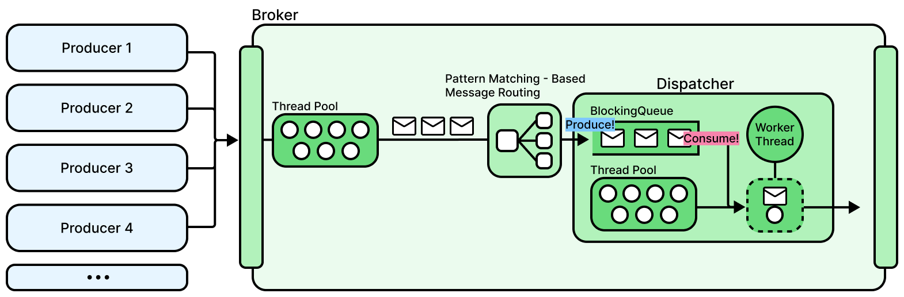
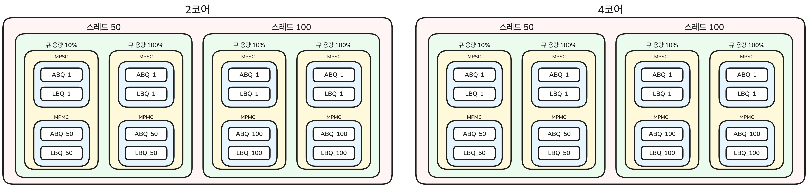

<!-- @formatter:off -->
# BlockingQueue 구현체 성능 비교분석 리포트

# 1. 실험 배경



메시징 미들웨어인 MMMQ의 핵심 컴포넌트인 브로커(Broker)는 다수의 생산자(Publisher)가 발행한 메시지를 브로커 내부 단일 Worker 스레드가 라우팅하는 다중 생산자-단일 소비자(MPSC) 아키텍처로 동작합니다.

초당 수만 건 이상의 트래픽이 집중되는 환경에서는 메시지 버퍼로 사용되는 큐의 동시성 보장으로 인한 병목은 브로커 시스템의 처리량과 레이턴시를 결정하는 가장 큰 요인입니다.

자바 표준 라이브러리가 제공하는 BlockingQueue(동시성 제어 큐)의 구현체인 ArrayBlockingQueue와 LinkedBlockingQueue는 동기화 방식과 메모리 할당, 사용 패턴이 근본적으로 다릅니다.

따라서, 다양한 상황에서의 부하 테스트를 통해 MMMQ의 브로커 메시지 처리 파이프라인에 최적화된 BlockingQueue 구현체를 선정하고자 합니다.

> **다중 생산자-단일 소비자(MPSC) 환경**: 다수의 스레드가 공유 큐에 데이터를 삽입하고, 오직 1개의 스레드만 데이터를 추출하는 구조입니다.
>
> **다중 생산자-다중 소비자(MPMC) 환경**: 다수의 스레드가 데이터를 삽입하고, 동시에 다수의 스레드가 데이터를 추출하는 구조입니다.


# 2. 실험 방식



## 2-1. 스레드 수

동시성 수준에 따른 병목 지점을 파악하기 위해 생산자 스레드는 50개 및 100개로 고정하고, 소비자 스레드 수는 1개 및 생산자와 동일한 수(50개/100개)로 나누어 측정했습니다.

- 생산자 N : 소비자 N
- 생산자 N : 소비자 1
- N = {50, 100}

## 2-2. 생산/소비 메서드

메시지 생산/소비 시 타임아웃(Timeout) 없는 `offer(e)`와 `poll()` 메서드를 사용했습니다.

무한 대기하는 `put()`/`take()`나 타임아웃 기반의 `offer(e, timeout, unit)`/`poll(timeout, unit)`을 배제한 이유는 다음과 같습니다.

### MMMQ 브로커의 실제 동작 환경 반영

MMMQ 브로커는 메시징 트래픽을 지연 없이 라우팅하는 것을 지향합니다.

큐가 가득 차거나 비어있을 때 스레드가 Blocking되는 방식 대신, 즉시 실패하고 후속 로직(예: backpressure, NACK 처리, 지수적 백오프 등)을 수행하는 빠른 실패 구조를 지향합니다.

무한 대기하는 `put()`/`take()`나 타임아웃 기반의 `offer(e, timeout, unit)`/`poll(timeout, unit)`은 Condition await 후 signal을 받을 때까지 스레드를 대기 상태로 유지시킵니다.

이 대기 시간은 MMMQ 브로커의 빠른 실패 구조에 적합하지 않기 때문에 사용하지 않습니다.

실제 MMMQ 프로젝트에서 타임아웃 없는 `offer(e)`와 `poll()`을 사용하므로, 벤치마크 역시 동일한 메서드를 채택하여 운영 환경과 일치시켰습니다.

## 2-3. 큐 용량

기본 큐 용량을 20,000,000(2천만)으로 설정한 후, 기본 큐 용량을 기준으로 10%와 100% 상황을 실험했습니다.

큐가 빠르게 가득 차는 상황(10% 용량)과 공간이 충분하여 느리게 가득 차는 상황(100% 용량)을 물리적으로 분리하기 위함입니다.

포화 속도를 다르게 설정함으로써, 큐가 조기에 가득 차서 생산 실패가 빈번하게 일어나는 환경과, 여유 공간이 충분하여 락 경합이 집중되는 환경 등 다양한 상태에서의 성능 데이터를 수집하고 비교하고자 했습니다.

## 2-4. CPU 코어 제어 및 격리

다중 코어 환경에서 캐시 일관성 연산이 미치는 영향을 확인하기 위해 2 Core 환경과 4 Core ~~/ RAM 8GB~~ 환경으로 나누어 진행했습니다.

### 베어메탈 인스턴스 활용을 통한 Hypervisor 노이즈 제거

- 가상머신 환경에서는 Hypervisor의 스케줄링에 의해 프로세스가 실행되는 물리 코어가 수시로 변경되어 L1, L2 캐시 증발 현상이 발생하며, PMU(Performance Monitoring Unit) 접근이 차단되거나 왜곡됩니다.
- 이를 방지하기 위해 베어메탈 인스턴스를 활용하여 리눅스 perf 를 제한 없이 사용 가능하게 만들어 L1 캐시 미스와 히트율, IPC (Instructions Per Cycle)를 측정했습니다.

> **PMU(Performance Monitoring Unit)**: CPU 코어 내부에 물리적으로 내장된 성능 측정 전용 하드웨어 모듈입니다. 프로세서가 명령어를 실행하는 동안 발생하는 다양한 하드웨어 이벤트(명령어 실행 횟수, L1/L2/L3 캐시 미스, 분기 예측 실패, CPU 정지 사이클 등)를 실시간으로 기록합니다.

### cgroup을 활용한 코어 격리

- 베어메탈 환경에서 taskset을 사용한 JVM 프로세스 코어 분리 및 할당 방식은 CPU Pinning은 강제할 수 있으나, 다른 프로세스의 스레드로 인한 L1, L2 캐시 무효화 노이즈는 막을 수 없습니다.
- 이를 해결하기 위해 cgroup을 사용하여 시스템 및 사용자 프로세스들을 모두 비격리 코어로 이동시킨 후, 벤치마크 JVM 프로세스만 독점적으로 사용할 수 있는 격리 코어 환경을 구축했습니다.
- 이를 통해 코어 수 확장이 락 경합에 미치는 물리적 영향을 노이즈 없이 통제했습니다.

> **taskset**: 리눅스 운영체제에서 프로세스나 스레드가 실행될 물리적 CPU 코어를 지정하는 명령어입니다.
>
> **CPU Pinning**: 특정 프로세스나 스레드가 지정된 물리적 CPU 코어에서만 실행되도록 묶어두는 기술입니다.
>
> **cgroup**: 리눅스 커널이 프로세스들의 시스템 하드웨어 자원(CPU, 메모리, 디스크 I/O, 네트워크 대역폭 등) 사용량을 제한하고 격리하는 제어 기능입니다.

## 2-5. 하드웨어 성능 지표 측정 (perf)

스레드 락 경합이 하드웨어 파이프라인에 미치는 물리적 영향을 교차 검증하기 위해 리눅스 perf 도구를 활용하여 다음 지표들을 수집했습니다.

- **L1 캐시 미스와 히트율**
   - 다중 코어 환경에서 스레드들이 동일한 데이터를 동시에 수정할 때 발생하는 캐시 일관성 프로토콜(예: MESI)에 의한 캐시 라인 무효화 빈도를 파악할 수 있습니다.
- **IPC (Instructions Per Cycle)**
   - 캐시 일관성 프로토콜로 인해 다른 코어에서 데이터를 가져오거나 캐시 미스로 인해 하위 메모리 계층에서 데이터를 가져오는 동안 CPU Stall의 심각도를 파악할 수 있습니다.

> **perf**: 리눅스 커널에 내장된 시스템 성능 분석 도구입니다.
>
> **캐시 일관성 프로토콜**: 다중 코어 프로세서 환경에서 각 CPU 코어가 가진 개별 캐시 메모리들의 데이터가 항상 동일한 최신 값을 유지하도록 동기화하는 하드웨어 프로토콜입니다.
>
> **CPU Stall**: CPU 파이프라인 내부에서 다음 명령어를 실행하지 못하고 하드웨어가 멈춰 대기하는 상태를 의미합니다.
>
> **IPC**: CPU가 1개의 클럭 사이클 동안 실행을 완료하는 명령어(Instruction)의 개수를 의미합니다.

## 2-6. 프로파일링 및 벤치마크 도구 설정 (JMH, JFR, JMC)

### JMH, JFR을 사용한 벤치마크 환경 구축

OpenJDK에서 제공하는 공식 벤치마크 프레임워크인 JMH(Java Microbenchmark Harness)를 도입하고 다음과 같이 환경을 통제했습니다.

- Throughput 모드로 초당 작업 처리량(ops/ms)을 측정했습니다.
  - 10초 동안 생산자/소비자 스레드가 메시지 생산(`offer(e)`)과 소비(`poll()`) 연산을 쉬지 않고 반복 실행하게 한 뒤, 누적된 총 연산 횟수를 산출했습니다.
- JIT 컴파일러에 의한 런타임 최적화를 반영하기 위해 10회의 Warmup Iteration을 수행했습니다.
   - Warmup 단계에서 수집된 노이즈 데이터를 배제하기 위해 벤치마크 코드에 커스텀 마커를 삽입하여 실제 측정 구간만 분리했습니다.
- Blackhole을 통해 JIT 컴파일러 최적화를 방지했습니다.
   - JIT 컴파일러의 Dead Code Elimination(죽은 코드 제거) 최적화로 인해 메시지 소비 연산이 생략되는 것을 방지하기 위해 메시지 소비 로직을 `Blackhole.consume()`으로 구현했습니다.
- 락 경합 수치, 원인을 파악하기 위해 JFR(Java Flight Recorder)을 사용해 애플리케이션 이벤트를 수집했습니다.

> Dead Code Elimination(죽은 코드 제거): JIT 컴파일러가 자바 바이트코드를 기계어로 변환할 때, 프로그램의 최종 실행 결과에 영향을 주지 않는 불필요한 코드를 식별하여 삭제하는 최적화 기법입니다.

### JMC

- JMH와 JFR을 통해 도출된 jfr 파일을 시각화하고 애플리케이션 이벤트를 분석하기 위해 JMC(JDK Mission Control)을 사용했습니다.
- Java Thread Park 이벤트를 Class Parked On 기준으로 그룹화하여, ReentrantLock 내 스레드 대기 이벤트를 측정했습니다.
   - `ReentrantLock.lock()`의 StackTrace를 분석해 `offer(e)`, `poll()`의 락 대기 시간, 횟수를 측정했습니다.

# 3. 실험 결과 분석 과정

JMC를 통해 JFR 데이터를 로드하고, 커스텀 마커 이후의 이벤트만 필터링하여 워밍업 데이터를 배제했습니다.

이후, Java Thread Park 이벤트 중 `ReentrantLock.lock()` 호출로 인해 대기(Park) 상태로 전환된 스택트레이스를 추적하여 락 경합의 원인을 다음 3가지로 분류하고 수치화했습니다.

1. 메시지 생산 시 락 획득을 위한 스레드 대기 시간
   - 데이터를 큐에 삽입하는 과정에서 임계 영역 진입을 위한 락을 획득하지 못한 스레드가 ReentrantLock 내부 AQS(AbstractQueuedSynchronizer)에 대기열 노드로 등록(park)된 후 운영체제 레벨에서 대기(waiting) 상태로 전환되어 잠들어 있던 시간입니다.
   - 생산자 간의 경합을 의미합니다.
2. 메시지 소비 시 락 획득을 위한 스레드 대기 시간
   - 데이터를 큐에 추출하는 과정에서 임계 영역 진입을 위한 락을 획득하지 못한 스레드가 ReentrantLock 내부 AQS에 대기열 노드로 등록된 후 운영체제 레벨에서 대기 상태로 전환되어 잠들어 있던 시간입니다.
   - 소비자 간의 경합을 의미합니다.
3. Condition(notFull) 신호 전달을 위한 생산 락 획득 대기 시간 (LinkedBlockingQueue 한정)
   - LinkedBlockingQueue는 생산 락과 소비 락이 분리되어 있으나, 데이터를 성공적으로 추출한 소비자가 대기 중인 생산자를 깨우기 위해 Condition(notFull)에 신호를 보낼 때 생산 락을 추가로 획득해야 합니다.
   - 이 과정에서 소비자가 생산 락을 얻기 위해 대기한 시간으로, 분리 락 구조가 가지는 Condition 대기 오버헤드를 나타냅니다.

# 4. 실험 결과

다음은 실험 데이터 분석에 필수적인 핵심 지표(처리량, GC, IPC, 락 대기)를 추출하여 요약한 표입니다.

## 4-1. 실험군 명명 규칙

본 리포트의 성능 지표에서 사용된 측정 대상 명칭은 **[BlockingQueue 구현체]_[소비자 스레드 수]** 형식의 명명 규칙을 따릅니다.

생산자 스레드의 수는 해당 환경의 최대 스레드 수(50/100개)로 통제하여 고정했습니다.

- **ABQ**: ArrayBlockingQueue 기반의 브로커 파이프라인
- **LBQ**: LinkedBlockingQueue 기반의 브로커 파이프라인
- **_1 접미사**: 소비자 스레드가 1개인 MPSC 환경입니다.
   - 생산자 스레드는 50/100개입니다.
- **_50, _100 접미사**: 소비자 스레드가 생산자 스레드 수와 동일한 MPMC 환경입니다.
   - 생산자 스레드는 50/100개입니다.
- **offer**: 생산 연산으로, BlockingQueue의 `offer(e)` 메서드입니다.
- **poll**: 소비 연산으로, BlockingQueue의 `poll()` 메서드입니다.

> 예시: ABQ_1은 ArrayBlockingQueue를 사용하며, 50/100의 생산자 스레드가 1개의 소비자 스레드와 통신하는 환경을 의미합니다.
> 예시: LBQ_50은 LinkedBlockingQueue를 사용하며, 50개의 생산자 스레드가 50개의 소비자 스레드와 통신하는 환경을 의미합니다.

## 4-2. 2 Core 환경

### 스레드 50

| **큐 용량** | **측정 대상**  | **처리량 (ops/ms)** | **생산 비중** | **소비 비중**  | **메모리 사용량 (MB)** | **GC 시간 (ms)** | **GC 횟수** | **캐시 히트율** | **캐시 미스**     | **IPC**  | **총 대기 시간 (ms)** | **총 대기 수** | **offer 대기 시간 (ms)** | **offer 대기 수** | **poll 대기 시간 (ms)** | **poll 대기 수** | **Condition(notFull) 대기 시간 (ms)** | **Condition(notFull) 대기 수** |
|----------|------------|------------------|-----------|------------|-------------|----------------|-----------|------------|---------------|----------|------------------|------------|----------------------|----------------|---------------------|---------------|-----------------------------------|-----------------------------|
| **10%**  | **ABQ_1**  | 1,133.75 🟥     | 58.72%    | 41.28% 🟨 | 9.46        | X              | X         | 97.58%     | 18,145.96     | 1.10     | 119.0            | 9.8        | 116.6                | 9.6            | 2.4                 | 0.2           | X                                 | X                           |
| **10%**  | **LBQ_1**  | 5,623.38 🟥     | 49.99%    | 50.01%     | 74.77       | 1.60           | 0.60      | 95.34%     | 39,414.97     | 0.48     | X                | X          | X                    | X              | X                   | X             | X                                 | X                           |
| **10%**  | **ABQ_50** | 20,306.64 🟩    | 50.09%    | 49.91%     | 14.71       | X              | X         | 98.04%     | 17,278.44 🟫 | 1.19 🟦 | 1,491.0          | 71.4       | 774.6                | 36.6           | 716.4               | 34.8          | X                                 | X                           |
| **10%**  | **LBQ_50** | 7,355.29 🟩     | 50.82%    | 49.18%     | 100.83      | 134.20         | 1.60      | 94.95%     | 22,880.82 🟫 | 0.53 🟦 | 13,884.4         | 146.6      | 6,844.4              | 74.6           | 7,015.8             | 70.6          | 24.2                              | 1.4                         |
| **100%** | **ABQ_1**  | 3,161.07 🟥     | 81.58%    | 18.42% 🟨 | 16.02       | X              | X         | 98.83%     | 19,529.81     | 1.37     | 18.2             | 1.8        | 16.2                 | 1.6            | 2.0                 | 0.2           | X                                 | X                           |
| **100%** | **LBQ_1**  | 4,449.90 🟥     | 49.98%    | 50.02%     | 68.30       | 1.80           | 0.60      | 96.12%     | 51,394.25     | 0.53     | X                | X          | X                    | X              | X                   | X             | X                                 | X                           |
| **100%** | **ABQ_50** | 20,359.63 🟩    | 50.00%    | 50.00%     | 21.89       | 2.00           | 0.20      | 98.00%     | 15,246.14 🟫 | 1.21 🟦 | 2,190.0          | 118.6      | 1,111.0              | 59.8           | 1,079.0             | 58.8          | X                                 | X                           |
| **100%** | **LBQ_50** | 7,394.79 🟩     | 52.56%    | 47.44%     | 110.06      | 1.00           | 0.20      | 95.19%     | 23,991.66 🟫 | 0.46 🟦 | 1,029.6          | 61.4       | 441.6                | 21.8           | 588.0               | 39.6          | X                                 | X                           |

### 스레드 100

| **큐 용량** | **측정 대상**   | **처리량 (ops/ms)** | **생산 비중** | **소비 비중**  | **메모리 사용량 (MB)** | **GC 시간 (ms)** | **GC 횟수** | **캐시 히트율** | **캐시 미스 횟수** | **IPC**  | **총 대기 시간 (ms)** | **총 대기 수** | **offer 대기 시간 (ms)** | **offer 대기 수** | **poll 대기 시간 (ms)** | **poll 대기 수** | **Condition(notFull) 대기 시간 (ms)** | **Condition(notFull) 대기 수** |
|----------|-------------|------------------|-----------|------------|-------------|----------------|-----------|------------|--------------|----------|------------------|------------|----------------------|----------------|---------------------|---------------|-----------------------------------|-----------------------------|
| **10%**  | **ABQ_1**   | 747.20 🟥       | 63.08%    | 36.92% 🟨 | 15.52       | 4.00           | 0.20      | 97.57%     | 1,378.99     | 0.99     | 2,899.8          | 157.6      | 2,873.4              | 156.2          | 26.4                | 1.4           | X                                 | X                           |
| **10%**  | **LBQ_1**   | 4,034.09 🟥     | 49.96%    | 50.04%     | 62.61       | 1.20           | 0.40      | 96.09%     | 5,076.07     | 0.56     | 1,696.6          | 83.8       | 1,696.6              | 83.8           | X                   | X             | X                                 | X                           |
| **10%**  | **ABQ_100** | 19,456.23 🟩    | 49.97%    | 50.03%     | 22.95       | 2.20           | 0.40      | 99.24%     | 3,203.99 🟫 | 1.33 🟦 | 2,001,197.8      | 112,566.4  | 1,001,309.8          | 56,275.8       | 999,888.0           | 56,290.6      | X                                 | X                           |
| **10%**  | **LBQ_100** | 7,214.39 🟩     | 50.34%    | 49.66%     | 105.19      | 26.40          | 0.40      | 97.67%     | 4,626.92 🟫 | 0.75 🟦 | 20,782.0         | 433.2      | 8,642.2              | 212.6          | 11,924.2            | 212.4         | 215.6                             | 8.2                         |
| **100%** | **ABQ_1**   | 2,458.97 🟥     | 90.56%    | 9.44% 🟨  | 21.43       | 34.80          | 0.20      | 98.66%     | 1,695.51     | 1.29     | 2,394.0          | 125.6      | 2,377.2              | 124.6          | 16.8                | 1.0           | X                                 | X                           |
| **100%** | **LBQ_1**   | 4,230.01 🟥     | 49.95%    | 50.05%     | 71.58       | 1.20           | 0.40      | 96.81%     | 7,644.61     | 0.59     | 1,595.0          | 69.8       | 1,595.0              | 69.8           | X                   | X             | X                                 | X                           |
| **100%** | **ABQ_100** | 19,582.77 🟩    | 49.98%    | 50.02%     | 29.91       | 3.80           | 0.40      | 99.35%     | 1,638.78 🟫 | 1.46 🟦 | 1,999,447.8      | 115,567.0  | 999,710.4            | 57,776.2       | 999,737.4           | 57,790.8      | X                                 | X                           |
| **100%** | **LBQ_100** | 6,845.90 🟩     | 54.44%    | 45.56%     | 111.36      | 875.60         | 4.40      | 97.53%     | 5,278.40 🟫 | 0.65 🟦 | 191,961.0        | 1,159.2    | 95,576.6             | 553.4          | 96,045.0            | 573.8         | 339.4                             | 32.0                        |

## 4-3. 4 Core 환경

### 스레드 50

| **큐 용량** | **측정 대상**  | **처리량 (ops/ms)** | **생산 비중** | **소비 비중**  | **메모리 사용량 (MB)** | **GC 시간 (ms)** | **GC 횟수** | **캐시 히트율** | **캐시 미스**     | **IPC**  | **총 대기 시간 (ms)** | **총 대기 수** | **offer 대기 시간 (ms)** | **offer 대기 수** | **poll 대기 시간 (ms)** | **poll 대기 수** | **Condition(notFull) 대기 시간 (ms)** | **Condition(notFull) 대기 수** |
|----------|------------|------------------|-----------|------------|-------------|----------------|-----------|------------|---------------|----------|------------------|------------|----------------------|----------------|---------------------|---------------|-----------------------------------|-----------------------------|
| **10%**  | **ABQ_1**  | 979.96 🟥       | 60.05%    | 39.95% 🟨 | 9.45        | X              | X         | 97.62%     | 15,461.96     | 1.06     | 136.6            | 11.2       | 131.8                | 10.8           | 4.8                 | 0.4           | X                                 | X                           |
| **10%**  | **LBQ_1**  | 4,025.65 🟥     | 49.99%    | 50.01%     | 56.60       | 0.60           | 0.20      | 95.97%     | 51,122.74     | 0.47     | X                | X          | X                    | X              | X                   | X             | X                                 | X                           |
| **10%**  | **ABQ_50** | 20,519.79 🟩    | 50.01%    | 49.99%     | 15.25       | X              | X         | 98.27%     | 12,682.80 🟫 | 1.31 🟦 | 2,990.0          | 188.4      | 1,557.6              | 95.8           | 1,432.4             | 92.6          | X                                 | X                           |
| **10%**  | **LBQ_50** | 7,552.56 🟩     | 50.02%    | 49.98%     | 102.09      | 2.40           | 0.40      | 95.66%     | 16,300.24 🟫 | 0.58 🟦 | 2,287.6          | 167.2      | 797.6                | 65.2           | 1,369.8             | 91.8          | 120.2                             | 10.2                        |
| **100%** | **ABQ_1**  | 2,873.46 🟥     | 84.74%    | 15.26% 🟨 | 16.11       | X              | X         | 98.15%     | 19,052.35     | 1.14     | 182.2            | 16.0       | 177.8                | 15.6           | 4.4                 | 0.4           | X                                 | X                           |
| **100%** | **LBQ_1**  | 4,692.69 🟥     | 49.99%    | 50.01%     | 70.19       | 1.80           | 0.40      | 94.98%     | 59,013.95     | 0.43     | 214.4            | 19.2       | 214.4                | 19.2           | X                   | X             | X                                 | X                           |
| **100%** | **ABQ_50** | 18,825.69 🟩    | 49.98%    | 50.02%     | 21.72       | X              | X         | 98.32%     | 8,246.39 🟫  | 1.30 🟦 | 2,404.8          | 135.8      | 1,434.2              | 72.4           | 970.6               | 63.4          | X                                 | X                           |
| **100%** | **LBQ_50** | 8,283.68 🟩     | 50.20%    | 49.80%     | 116.81      | 1.20           | 0.40      | 94.52%     | 30,608.68 🟫 | 0.50 🟦 | 2,599.4          | 96.0       | 428.4                | 30.0           | 862.8               | 64.2          | 44.2                              | 1.8                         |

### 스레드 100

| **큐 용량** | **측정 대상**   | **처리량 (ops/ms)** | **생산 비중** | **소비 비중**  | **메모리 사용량 (MB)** | **GC 시간 (ms)** | **GC 횟수** | **캐시 히트율** | **캐시 미스**    | **IPC**  | **총 대기 시간 (ms)** | **총 대기 수** | **offer 대기 시간 (ms)** | **offer 대기 수** | **poll 대기 시간 (ms)** | **poll 대기 수** | **Condition(notFull) 대기 시간 (ms)** | **Condition(notFull) 대기 수** |
|----------|-------------|------------------|-----------|------------|-------------|----------------|-----------|------------|--------------|----------|------------------|------------|----------------------|----------------|---------------------|---------------|-----------------------------------|-----------------------------|
| **10%**  | **ABQ_1**   | 637.02 🟥       | 65.32%    | 34.68% 🟨 | 14.87       | X              | X         | 98.29%     | 483.22       | 1.16     | 1,890.2          | 85.0       | 1,859.6              | 83.8           | 30.6                | 1.2           | X                                 | X                           |
| **10%**  | **LBQ_1**   | 4,247.57 🟥     | 49.96%    | 50.04%     | 64.94       | 0.40           | 0.20      | 97.39%     | 4,630.62     | 0.69     | 1,705.8          | 60.0       | 1,705.8              | 60.0           | X                   | X             | X                                 | X                           |
| **10%**  | **ABQ_100** | 19,641.51 🟩    | 50.00%    | 50.00%     | 23.06       | X              | X         | 99.31%     | 1,693.86 🟫 | 1.41 🟦 | 2,000,952.6      | 64,481.0   | 999,898.4            | 58,609.4       | 1,001,054.2         | 5,871.6       | X                                 | X                           |
| **10%**  | **LBQ_100** | 6,382.36 🟩     | 50.43%    | 49.57%     | 95.68       | 1.00           | 0.20      | 97.95%     | 3,283.32 🟫 | 0.80 🟦 | 15,792.8         | 330.8      | 6,113.0              | 134.2          | 9,204.4             | 178.4         | 475.4                             | 18.2                        |
| **100%** | **ABQ_1**   | 2,565.45 🟥     | 88.85%    | 11.15% 🟨 | 22.13       | X              | X         | 98.80%     | 2,225.25     | 1.35     | 2,214.6          | 117.8      | 2,189.4              | 116.6          | 25.2                | 1.2           | X                                 | X                           |
| **100%** | **LBQ_1**   | 4,007.78 🟥     | 49.95%    | 50.05%     | 69.06       | 0.40           | 0.20      | 96.63%     | 7,226.02     | 0.61     | 1,958.8          | 76.4       | 1,958.8              | 76.4           | X                   | X             | X                                 | X                           |
| **100%** | **ABQ_100** | 19,257.95 🟩    | 50.01%    | 49.99%     | 29.22       | X              | X         | 99.39%     | 1,663.71 🟫 | 1.48 🟦 | 2,009,666.8      | 117,847.0  | 1,004,716.2          | 58,917.8       | 1,004,950.6         | 58,929.2      | X                                 | X                           |
| **100%** | **LBQ_100** | 7,627.44 🟩     | 51.68%    | 48.32%     | 118.40      | 0.60           | 0.20      | 97.84%     | 4,760.17 🟫 | 0.83 🟦 | 17,654.2         | 508.6      | 8,098.8              | 256.0          | 9,246.8             | 249.2         | 308.6                             | 3.4                         |

# 5. 실험 결과 분석

## 5-1. 단일 소비자 환경에서 LinkedBlockingQueue의 승리

MPSC 환경에서는 LinkedBlockingQueue가 ArrayBlockingQueue 대비 더 높은 처리량을 기록했습니다. (🟥 참고)

원인은 LinkedBlockingQueue의 분리된 락 구조로, 소비자가 생산자와 경쟁하지 않고 독립적으로 락을 획득하여 큐를 비워낼 수 있었기 때문입니다.

### ArrayBlockingQueue의 병목: 단일 락 경합으로 인한 소비 지연과 무효 연산(생산 실패) 증가

ArrayBlockingQueue는 단일 ReentrantLock을 기반으로 생산/소비를 제어합니다.

$\text{생산자의 락 획득 확률} = \frac{\text{생산자 스레드 수}}{\text{생산자 스레드 수 + 1}}
\qquad
\text{소비자의 락 획득 확률} = \frac{\text{1}}{\text{생산자 스레드 수 + 1}}$

1개의 소비자 스레드는 다수의 생산자 스레드들과 락 경합을 벌여야 하므로, 소비자의 락 획득 성공 확률은 생산자 집단 대비 크게 낮아집니다.

스레드 수가 증가할수록, 큐 용량이 증가할수록 소비자의 연산량은 생산자 대비 감소하고 있습니다. (🟨 참고)

결과적으로 소비자의 데이터 소비 주기가 길어지며 큐는 빠르게 포화 상태에 도달합니다.

큐가 가득 찬 상태가 지속되면 락을 획득한 생산자는 데이터를 삽입하지 못하고 `false`를 반환받습니다.

이로 인해 생산자는 데이터를 삽입하지 못하고 락을 낭비하며 CPU 사이클과 소비자의 락 획득 기회만 낭비하는 결과를 만들게 됩니다.

### LinkedBlockingQueue의 우위: 분리된 락을 통한 소비자 연산 보장

반면, LinkedBlockingQueue는 삽입 임계 영역을 통제하는 생산 락과 추출 임계 영역을 통제하는 소비 락이 분리된 자료구조입니다.

단일 소비자 환경에서 유일한 소비자 스레드는 생산자들의 생산 락 경합의 영향을 받지 않고 독점적으로 소비 락을 획득합니다.

소비자는 생산자 측의 경합과 무관하게 데이터를 지속적으로 소비하여 큐의 빈 공간을 확보합니다.

소비자의 안정적인 데이터 추출이 큐의 포화를 막아주므로, 생산자 스레드들은 큐 포화로 인한 생산 연산 실패 없이 생산할 수 있어 ABQ 대비 높은 처리량을 달성하게 됩니다.

## 5-2. 다중 소비자 환경에서 ArrayBlockingQueue의 승리

MPMC 환경에서는 ArrayBlockingQueue가 LinkedBlockingQueue 대비 더 높은 처리량을 기록했습니다. (🟩 참고)

원인은 다중 스레드 환경에서 LinkedBlockingQueue의 단일 공유 카운터(AtomicInteger) 경합과 Node 객체 생성에 따른 L1, L2 캐시 미스 오버헤드가 ABQ의 단일 락 비용을 초과했기 때문입니다.

또한, 생산자-소비자 스레드 수의 불균형 해소로 인해 ArrayBlockingQueue의 단일 락 경합으로 인한 소비 지연이 완화되었기 때문입니다.

### LinkedBlockingQueue의 병목 1: 공유 카운터(AtomicInteger)로 인한 하드웨어 레벨 병목

LinkedBlockingQueue는 생산 락과 소비 락을 분리하여 생산-소비 간 경합을 줄였으나, 큐의 원소 개수를 추적하는 `count` 변수는 양측 스레드가 공유합니다.

```java
// LinkedBlockingQueue의 offer 메서드
public boolean offer(E e) {
    if (e == null)
        throw new NullPointerException();
    final AtomicInteger count = this.count;
    if (count.get() == capacity)
        return false;
    final int c;
    final Node<E> node = new Node<E>(e);
    final ReentrantLock putLock = this.putLock;
    putLock.lock();
    try {
        if (count.get() == capacity)
            return false;
        enqueue(node);
        c = count.getAndIncrement();
        if (c + 1 < capacity)
            notFull.signal();
    } finally {
        putLock.unlock();
    }
    if (c == 0)
        signalNotEmpty();
    return true;
}
```

`count` 변수는 AtomicInteger로 구현되어 있으며, MPMC 환경에서는 양측 스레드가 동시에 `count.getAndIncrement()`와 `count.getAndDecrement()`를 호출합니다.

이 메서드들은 내부적으로 CAS(Compare And Swap) 연산을 do-while 루프를 통해 수행하므로 CAS 오버헤드, 경합 시 반복 실행에 따른 오버헤드가 발생합니다.

하나의 코어에서 CAS 연산을 통해 값을 수정할 때마다, 캐시 일관성 프로토콜에 의해 다른 모든 코어의 캐시에서 해당 변수가 포함된 캐시 라인이 무효화됩니다.

또한, LinkedBlockingQueue의 `offer(e)` 메서드는 큐 용량 초과 시 빠른 실패를 위해 락 획득 전에 `count.get()` 읽기 연산을 수행합니다.

`count.get()`은 volatile 변수 읽기 연산이며, 현재 코어의 L1, L2 캐시에 있는 데이터에 대한 소유권이 없다면 캐시 일관성 프로토콜에 의해 CPU 코어 버스를 통해 다른 코어에게 데이터를 요청해야 합니다.

MPMC 환경에서는 다른 코어들의 지속적인 값 수정으로 인해 캐시 라인이 이미 무효화되어 있을 확률이 높으므로, `count.get()` 연산은 높은 확률로 코어 간 버스 통신을 유발합니다.

결과적으로 락 획득 전후로 `count` 변수에 접근할 때마다 하드웨어 지연이 발생하여 L1 캐시 히트율이 낮아집니다. 또한, 코어 간 통신을 대기하는 동안 CPU Stall이 발생하여 파이프라인이 중단되므로 ArrayBlockingQueue 대비 전체 IPC가 낮게 측정됩니다. (🟦 참고)

> **CAS(Compare And Swap)**: 특정 메모리 주소의 값이 예상한 기존 값과 일치하는 경우에만 새로운 값으로 덮어쓰는 원자적 하

### LinkedBlockingQueue의 병목 2: 동적 객체 할당과 코어 간 캐시 미스

LinkedBlockingQueue는 데이터 삽입 시 매번 새로운 Node(`new Node(e)`)를 생성합니다.

JVM의 할당 최적화(TLAB)가 적용되더라도 객체 헤더와 내부 필드를 초기화하는 데 추가적인 CPU 사이클이 소모됩니다.

더 큰 병목은 소비자가 데이터를 읽어오는 메모리 접근 패턴에서 발생합니다.

ArrayBlockingQueue는 배열 구조로, 메시지 객체를 저장하기 위해 연속된 메모리 공간을 사용합니다. 특정 코어가 연속적으로 연산할 기회를 얻었을 때, 한 번 읽어온 캐시 라인 내부에 다음 인덱스가 포함되어 있어 캐시 히트가 발생합니다.

반면, LinkedBlockingQueue의 Node들은 힙 메모리에 흩어져 있습니다. 이로 인해 특정 코어가 연속적으로 연산할 기회를 얻더라도 매 노드에 접근할 때마다 캐시 라인을 새로 읽어와야 합니다. 이러한 데이터 로드 작업이 CPU Stall을 유발하므로, ArrayBlockingQueue 대비 캐시 미스율이 높고(🟫 참고) IPC가 낮게 측정됩니다.(🟦 참고)

### ArrayBlockingQueue의 우위 1: 객체 생성 없는 참조 매핑과 단순한 내부 연산

ArrayBlockingQueue는 데이터를 삽입할 때 메시지 객체의 메모리 주소(참조값)만 배열의 특정 인덱스에 직접 매핑합니다.

객체 생성 오버헤드가 존재하지 않으며, Node 객체가 아닌 인덱스를 통해 메시지 객체에 접근하므로 LinkedBlockingQueue에 비해 캐시 미스 횟수가 낮습니다.(🟫 참고)

또한, 단일 락 내에서 동시성이 보장되므로 큐의 원소 개수를 관리할 때 AtomicInteger 대신 일반 int 변수의 단순 증감(`count++`, `count--`) 연산만 수행합니다.

결과적으로, 부가적인 오버헤드가 없고 내부 연산이 가벼운 ArrayBlockingQueue가 더 높은 전체 처리량을 기록하게 됩니다.

### ArrayBlockingQueue의 우위 2: 생산/소비 균형을 통한 소비 지연 해소

단일 소비자 환경에서 ArrayBlockingQueue의 처리량이 낮았던 가장 큰 이유는 1명의 소비자가 다수의 생산자와 락을 두고 경쟁해야 했기 때문입니다.

소비자가 락을 얻을 확률이 매우 낮아 큐를 제때 비우지 못했고, 큐가 가득 차면서 생산자의 `offer(e)` 연산도 지속적으로 실패했습니다.

MPMC 환경에서는 소비자 스레드 수가 생산자 스레드 수와 같습니다. 따라서 소비자의 락 획득 확률이 50%로 증가합니다.

소비자들이 락을 획득하는 빈도가 늘어나면서 큐의 데이터가 원활하게 빠져나가므로, 큐가 포화 상태가 되어 생산자의 삽입 연산이 버려지는 상황이 크게 줄어듭니다.

# 6. MPSC 환경에서 각 자료구조의 차이점

## 6-1. ArrayBlockingQueue

### 장점

1. 가벼운 내부 연산
   - 락을 획득한 상태에서 수행하는 연산이 매우 단순합니다. 동시성이 단일 락으로 완벽히 통제되므로 원소 개수 관리에 무거운 AtomicInteger 대신 일반 기본형 변수의 단순 증감(`count++`, `count--`) 연산만 수행합니다.
2. 객체 생성 없는 참조 매핑
   - ArrayBlockingQueue는 데이터를 삽입할 때 메시지 객체의 메모리 주소(참조값)만 배열의 특정 인덱스에 직접 매핑하기 때문에, 추가 객체 생성 오버헤드가 존재하지 않습니다.
3. 연속 연산 시 캐시 히트
   - 특정 코어가 연속적으로 연산할 기회를 얻었을 때, 한 번 읽어온 캐시 라인 내부에 다음 인덱스가 포함되어 있어 캐시 히트가 발생합니다.

### 단점

1. 단일 락으로 인한 소비 지연
   - 생산자와 소비자가 동일한 락을 두고 경쟁합니다. MPSC 환경에서는 유일한 소비자가 다수의 생산자 집단과 경쟁하므로 소비자의 락 획득 확률이 희박해집니다.
   - 이로 인해 데이터 추출이 지연되고 큐가 빠르게 포화 상태에 도달하여, 생산자의 `offer(e)` 연산까지 연쇄적으로 실패하게 됩니다.

## 6-2. LinkedBlockingQueue

### 장점

1. **분리 락을 통한 소비자 독립성 보장**
   - LinkedBlockingQueue는 삽입 임계 영역을 통제하는 생산 락과 추출 임계 영역을 통제하는 소비 락이 분리된 자료구조입니다.
   - 단일 소비자 환경에서 유일한 소비자 스레드는 생산자들의 생산 락 경합의 영향을 받지 않고 독점적으로 소비 락을 획득합니다.
   - 소비자는 생산자 측의 경합과 무관하게 데이터를 지속적으로 소비하여 큐의 빈 공간을 확보할 수 있어 처리량이 높습니다.

### 단점

1. 무거운 내부 연산 및 하드웨어 병목
   - 전체 원소 개수를 추적하기 위해 생산자/소비자 양측이 공유하는 AtomicInteger 기반 `count` 변수에 CAS 연산을 수행해야 합니다.
   - 생산자/소비자의 지속적인 연산이 수행되는 과정에서, 지속적으로 캐시 일관성 프로토콜이 동작하여 캐시 라인이 무효화되며, CPU 코어 버스 통신으로 인한 CPU Stall이 발생합니다.
2. 동적 객체 할당 오버헤드
   - 삽입 연산 시마다 새로운 Node 객체를 생성해야 하므로 객체 헤더 초기화 비용이 소모됩니다.
3. 연속 연산 시 캐시 미스
   - 특정 코어가 연속적으로 연산할 기회를 얻더라도 매 노드에 접근할 때마다 캐시 라인을 새로 읽어와야 합니다.

# 7. MMMQ 환경에서 적합한 자료구조와 이유

브로커(Broker)는 다수의 생산자(Publisher)가 발행한 메시지를 브로커 내부 단일 Worker 스레드가 라우팅하는 MPSC 아키텍처로 동작합니다.

이러한 비대칭적 스레드 구조에서는 하드웨어 내부의 캐시 효율성보다, 유일한 소비자인 Worker 스레드의 실행 기회 보장이 시스템 전체의 처리량을 결정하는 가장 중요한 요소가 됩니다.

LinkedBlockingQueue는 내부적으로 `volatile` 변수 읽기, AtomicInteger를 활용한 상태 변경, 그리고 연결 리스트의 한계로 인한 빈번한 캐시 미스 등 하드웨어 관점에서 비효율적인 요소가 많습니다. 따라서 연산의 효율성만 비교한다면 ArrayBlockingQueue를 사용하는 것이 이득입니다.

그러나, MPSC 환경에서는 ArrayBlockingQueue의 이러한 장점이 처리량 증가로 이어지지 못합니다. ArrayBlockingQueue는 단일 락을 사용하기 때문에 유일한 소비자가 다수의 생산자와 경쟁해야 합니다. 이로 인해 소비자가 락을 획득할 확률이 매우 낮아져 데이터 소비 자체가 지속적으로 지연됩니다.

락을 얻지 못해 작업을 수행하지 못한다면 ArrayBlockingQueue의 하드웨어적 이점은 무의미해집니다.

반면, LinkedBlockingQueue는 락이 분리되어 있어 생산자 측의 경합이 소비자의 실행을 방해하지 않습니다.

따라서, 자료구조 자체의 비효율을 감수하더라도 단일 소비자의 실행 기회를 독립적으로 보장하여 전체 메시지 처리량을 유지할 수 있는 LinkedBlockingQueue를 선택하는 것이 타당합니다.
